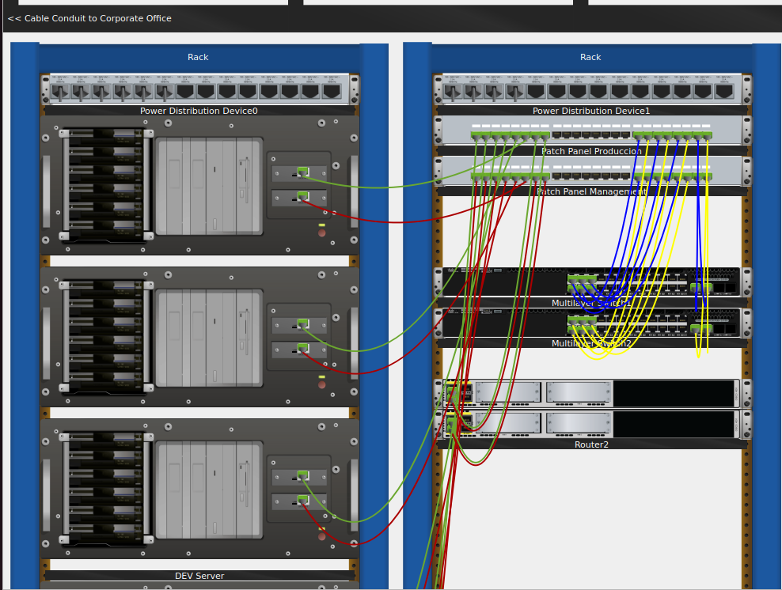
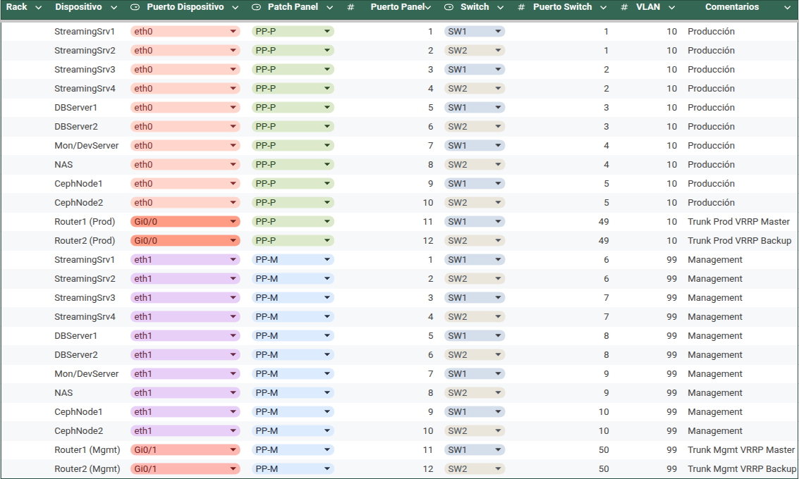

# Propuesta de diseño e implementación de un CPD

## Tabla de contenidos

---

## Introducción y analisis de requisitos

El fin de este documento es presentar una propuesta de diseño e implementación de un Centro de Procesamiento de Datos (CPD) para la empresa InnovateTech. InnovateTech es una empresa dedicada a la innovación tecnológica que ofrece servicios de streaming de audio y vídeo, así como soluciones de bases de datos y servidores web. Con el crecimiento de su base de clientes, InnovateTech ha decidido establecer un CPD para mejorar la eficiencia, seguridad y disponibilidad de sus servicios digitales.

El CPD es esencial para garantizar la disponibilidad, seguridad y eficiencia en la gestión de los sistemas informáticos y servicios digitales. InnovateTech requiere una solución que soporte la transmisión de contenido digital de alta calidad (audio y vídeo) junto con otros servicios, cumpliendo con estándares de sostenibilidad y seguridad, alineada con los ODS de la Agenda 2030.

Segun el escenario planteado inicialmente, basado en el numero de clientes estimados
se han establecido los siguientes requisitos y objetivos:

- Poder garantizar la disponibilidad de los servicios de streaming, web y base de datos.
- Hacer una implementacion future-proof, que este capacitada para futuras ampliaciones y mejoras.
- Estar preparados ante posibles fallos de hardware, software o ataques externos.

## Diseño conceptual integral

### Filosofía del diseño

La filosofía que orienta este diseño conceptual se basa en garantizar la máxima disponibilidad, escalabilidad y eficiencia operativa del Centro de Procesamiento de Datos (CPD). Aunque en su fase inicial el CPD será de dimensiones reducidas, con solo dos servidores configurados en modo activo-pasivo, el diseño ha sido concebido para ser completamente escalable y permitir la incorporación progresiva de nuevos recursos según las necesidades futuras. Se ha optado por un enfoque modular y flexible, que facilite futuras expansiones sin comprometer la continuidad del servicio ni incrementar significativamente los costes operativos. Además, el diseño se alinea con las buenas prácticas internacionales, priorizando la sostenibilidad energética y minimizando el impacto ambiental mediante la utilización eficiente de recursos y la elección de equipos de bajo consumo energético.

### Redundancia transversal

El concepto de redundancia transversal adoptado asegura que todos los sistemas críticos y subsistemas del CPD, como el suministro eléctrico, climatización, comunicaciones y almacenamiento, dispongan de al menos un mecanismo alternativo listo para asumir funciones en caso de fallo. En esta primera fase, la redundancia se implementará principalmente en la forma de una configuración de servidores activo-pasivo, en la que uno de los servidores actúa como respaldo automático en caso de fallo del servidor principal. También se incluirán sistemas duales de alimentación eléctrica y enlaces de red redundantes. Esta configuración transversal minimiza el riesgo de un único punto de fallo (SPOF) y asegura que cualquier interrupción pueda ser solventada automáticamente y en un tiempo mínimo, garantizando una alta disponibilidad del servicio.

### Niveles de seguridad

La seguridad del CPD se plantea de forma integral, abarcando niveles físicos, lógicos y procedimentales. Se prevén controles de acceso restringido, videovigilancia, sistemas de protección contra incendios, medidas contra ciberataques como firewalls e IDS/IPS, y protocolos claros de gestión de incidentes. Estas medidas conjuntas buscan proteger tanto la infraestructura como la información, garantizando la continuidad operativa.

---

## Arquitectura y diseño del CPD

### Situación fisica

La sala de servidores estara ubicada en el centro de la sede de InnovateTech en la planta baja. Esta, tendra una superficie de 10m², con una altura de 3m y un unico acceso por una puerta. La sala no contara con ventanas ni acceso directo al exterior. La iluminación será artificial, con un sistema de iluminación LED de bajo consumo.

Hemos decidido esta ubicación por su proximidad a la infraestructura de red y eléctrica existente, además de evitar posible riesgo de inundciones o intrusiones.

### Distribucion del espacio

La distribución del espacio se ha diseñado para maximizar la eficiencia operativa y la seguridad. La sala estará dividida en dos áreas principales: una zona de servidores y una zona de equipos auxiliares (UPS, sistemas de refrigeración, etc.). Los servidores se colocarán en racks modulares, permitiendo una fácil expansión futura. La zona de equipos auxiliares estará equipada con sistemas de alimentación ininterrumpida (UPS) y unidades de refrigeración.

La distribución del espacio se ha planificado de manera que se garantice un flujo de aire adecuado para la refrigeración de los equipos, evitando el sobrecalentamiento y asegurando un funcionamiento óptimo. Además, se han previsto pasillos de acceso para facilitar el mantenimiento y la gestión de los equipos.

### Suelo y revestimiento

Se ha decidido implementar un suelo técnico elevado, que permitirá una mejor gestión de los cables y una mayor flexibilidad en la distribución del espacio. Este tipo de suelo facilita el acceso a las instalaciones eléctricas y de red, permitiendo una rápida adaptación a futuros cambios o ampliaciones.

El revestimiento de las paredes será de material ignífugo y resistente a la humedad, garantizando la seguridad y durabilidad del CPD. Además, se instalarán paneles acústicos para reducir el ruido generado por los equipos.

### Climatización y refrigeración

Debido a la baja potencia de los equipos en esta fase inicial, se ha optado por un sistema de refrigeración por aire, con unidades de aire acondicionado de precisión que mantendrán una temperatura constante y adecuada para el funcionamiento de los servidores. Estos sistemas estarán equipados con sensores de temperatura y humedad para garantizar un ambiente óptimo.

Aunque en esta fase no se prevé demasiado flujo de aire caliente, los pasillos calientes se separarán de los fríos para evitar la mezcla de aire y garantizar una refrigeración eficiente. En futuras ampliaciones.

### Medidas de seguridad y ocultación

Para garantizar la seguridad física del CPD, se implementarán las siguientes medidas:
    - Control de acceso restringido mediante tarjetas magnéticas o biométricas.
    - Videovigilancia con cámaras de seguridad en tiempo real.
    - Sistemas de alarma contra intrusiones y detección de incendios.
    - Señalizacion neutra, sin logos ni identificativos de InnovateTech, para evitar llamar la atención sobre la sala de servidores.

## Infraestructura tecnológica y sistemas criticos

### Diseño de racks

En esta fase inicial, se instalarán tres racks modulares de 42U, que permitirán una fácil expansión futura. Cada rack estará equipado con sistemas de alimentación redundante y ventilación adecuada para garantizar un funcionamiento óptimo de los equipos.

Cada rack tendra un rol en la infraestructura del CPD:

-Rack 1: Servidores de aplicaciones, bases de datos y almacenamiento.
-Rack 2: Conectividad de red y seguridad (firewalls, switches, routers). 
-Rack 3: Sistemas auxiliares (UPS, sistemas de refrigeración, etc.).

El hardware elegido para esta fase inicial incluye:

| Rol/Dispositivo         | Modelo                        | CPU                                 | RAM           | Almacenamiento                                      | Puertos de Red         | Notas                        | U's Rack |
|-------------------------|-------------------------------|-------------------------------------|---------------|-----------------------------------------------------|------------------------|------------------------------|----------|
| Servidor Streaming (x4) | Dell PowerEdge R650xs         | 2x Intel Xeon Silver 4314 (16N, 2.4GHz) | 128GB DDR4 ECC | 2x 1.92TB NVMe SSD (RAID 1, SO) 4x 3.84TB NVMe SSD (RAID 10, medios) | 2x 10GbE SFP+           | Alto I/O, streaming en vivo   | 1U c/u   |
| Servidor BBDD (x2)      | HPE ProLiant DL380 Gen10 Plus | 2x Intel Xeon Gold 6330 (28N, 2.0GHz) | 256GB DDR4 ECC | 8x 3.84TB SAS SSD (RAID 10)                         | 2x 10GbE SFP+           | Redundante, alto rendimiento  | 2U c/u   |
| Servidor Monitorización | Supermicro SYS-6019U-TR4T     | 2x Intel Xeon Silver 4210R (10N, 2.4GHz) | 128GB DDR4 ECC | 2x 1.92TB NVMe SSD (RAID 1)                         | 2x 10GbE SFP+           | Elastic + Kibana             | 1U       |
| NAS                     | Synology RS3621xs+            | Intel Xeon D-1531 (6N, 2.2GHz)      | 32GB DDR4 ECC  | 12x 12TB SATA HDD (RAID 6)                          | 4x 1GbE, 2x 10GbE SFP+  | Expandible, backup           | 2U       |
| Nodo Ceph (x2)          | Dell PowerEdge R740xd         | 2x Intel Xeon Silver 4214 (12N, 2.2GHz) | 128GB DDR4 ECC | 12x 8TB SAS HDD (JBOD) 2x 1.92TB NVMe SSD (SO/journal) | 2x 10GbE SFP+           | Almacenamiento distribuido    | 2U c/u   |
| Patch Panel (x2)        | Leviton 24-Port Cat6A         | -                                   | -             | -                                                   | -                      | 1 prod, 1 gestión            | 1U c/u   |
| Switch (x2, stack)      | Cisco Catalyst C9300-48P-E    | -                                   | -             | -                                                   | 48x 1GbE PoE+, 4x 10GbE SFP+ | StackWise-480, spine-leaf    | 1U c/u   |
| Router (x2)             | Cisco ISR 4331                | Multinúcleo, hasta 100Mbps          | 8GB DRAM      | 8GB Flash                                           | 2x Gigabit Ethernet     | Redundante, WAN              | 1U c/u   |
| UPS                     | APC SRT6KRMXLI / Eaton 9PX 6000i RT3U | -                             | -             | Batería interna                                     | -                      | Online, gestión red           | 3U       |
| Baterías externas UPS   | APC SRT192BP / Eaton EBM      | -                                   | -             | Batería externa                                     | -                      | Expansión autonomía           | 3U c/u   |

DISTRIBUCION DEL HARDWARE EN RACKS:

ESBOZO EN PACKET TRACER SIMULACION:

### Diseño de red logico

La red del CPD se ha diseñado siguiendo un modelo de red spine-leaf, que permite una alta disponibilidad y escalabilidad. La red estará compuesta por dos capas principales: la capa spine, que incluye los routers de núcleo, y la capa leaf, que incluye los switches de acceso.

La capa spine estará formada por dos routers Cisco ISR 4331, que proporcionarán conectividad a Internet y a la red corporativa. Estos routers estarán configurados en modo activo-activo para garantizar la alta disponibilidad y el equilibrio de carga.

La capa leaf estará formada por dos switches Cisco Catalyst C9300-48P-E, que proporcionarán conectividad a los servidores y dispositivos de red. Estos switches estarán configurados en modo stack para permitir una gestión centralizada y una mayor capacidad de conmutación.

La red se segmentará en varias VLANs para separar el tráfico de los diferentes servicios (streaming, bases de datos, web, etc.). Se implementarán políticas de seguridad y control de acceso para garantizar que solo los dispositivos autorizados puedan comunicarse entre sí.

### Almacenamiento y backup

El sistema de almacenamiento del CPD se basará en una solución NAS Synology RS3621xs+ para el almacenamiento de datos y copias de seguridad. Este NAS estará configurado con 12 discos duros SATA de 12TB en RAID 6, lo que proporcionará una alta capacidad de almacenamiento y redundancia.

Además, se implementará un clúster Ceph con dos nodos Dell PowerEdge R740xd, que proporcionará almacenamiento distribuido y tolerancia a fallos. Este clúster estará configurado con 12 discos duros SAS de 8TB en modo JBOD y 2 discos NVMe de 1.92TB para el sistema operativo y el journal.

El sistema de backup se realizará de forma automática y periódica, utilizando la funcionalidad de snapshot del NAS y replicando los datos al clúster Ceph. Además, se implementarán políticas de retención de datos para garantizar que las copias de seguridad estén disponibles durante un período determinado.

### Conectividad y seguridad

La conectividad del CPD se garantizará mediante enlaces de red redundantes y de alta velocidad. Se utilizarán puertos 10GbE SFP+ para la conexión entre los servidores, el NAS y los switches, lo que proporcionará un ancho de banda suficiente para soportar el tráfico de datos generado por los servicios de streaming y bases de datos.
La seguridad de la red se implementará mediante firewalls y sistemas de detección y prevención de intrusiones (IDS/IPS). Se utilizarán firewalls de última generación para filtrar el tráfico entrante y saliente del CPD, así como IDS/IPS para monitorizar y bloquear posibles ataques. Estos sistemas estarán configurados para detectar patrones de tráfico sospechosos y alertar al personal de seguridad en caso de actividad anómala.

### Disponibilidad y tolerancia a fallos

La disponibilidad del CPD se garantizará mediante la implementación de redundancia en todos los sistemas críticos. Se utilizarán configuraciones de servidores activo-pasivo para asegurar que, en caso de fallo de un servidor, otro pueda asumir sus funciones sin interrupción del servicio. Además, se implementarán sistemas de alimentación ininterrumpida (UPS) para garantizar que los equipos sigan funcionando en caso de corte de energía.

### SAI'sy y baterías

Para garantizar la continuidad del servicio en caso de fallo de la alimentación eléctrica, se instalarán sistemas de alimentación ininterrumpida (UPS) de alta capacidad. Se ha optado por un modelo APC SRT6KRMXLI, que proporcionará una autonomía suficiente para mantener los sistemas críticos en funcionamiento durante un corte de energía.
Además, se instalarán baterías externas APC SRT192BP para ampliar la autonomía del sistema. Estos sistemas estarán conectados a todos los racks y equipos críticos, garantizando que, en caso de fallo de la alimentación eléctrica, los sistemas puedan seguir funcionando sin interrupción.

Para dimensionar correctamente el sistema de alimentación ininterrumpida (SAI/UPS) y las baterías externas, se ha realizado un cálculo del consumo energético total del CPD y la autonomía necesaria para garantizar la continuidad del servicio ante un corte de energía.

#### Estimación del consumo energético

| Dispositivo                        | Unidades | Consumo por unidad (W) | Total (W) |
|-------------------------------------|----------|------------------------|-----------|
| Servidor Streaming (Dell R650xs)    | 4        | 350                    | 1.400     |
| Servidor BBDD (HPE DL380)           | 2        | 500                    | 1.000     |
| Servidor Monitorización             | 1        | 350                    | 350       |
| NAS (Synology RS3621xs+)            | 1        | 250                    | 250       |
| Nodo Ceph (Dell R740xd)             | 2        | 400                    | 800       |
| Switch (Cisco C9300)                | 2        | 150                    | 300       |
| Router (Cisco ISR 4331)             | 2        | 50                     | 100       |
| Patch Panel                         | 2        | Despreciable           | 0         |
| **Total estimado**                  |          |                        | **4.200** |

Se añade un margen de seguridad del 20% para cubrir picos de consumo y futuras ampliaciones:

- **Consumo total estimado:** 4.200W × 1,2 = **5.040W**

#### Dimensionamiento del SAI y baterías

- **Modelo SAI seleccionado:** APC SRT6KRMXLI (6.000W)
- **Baterías externas:** APC SRT192BP

##### Autonomía estimada según configuración

- **Solo SAI (batería interna):** ~5 minutos a plena carga (6.000W)
- **SAI + 1 batería externa:** ~15 minutos a plena carga
- **SAI + 2 baterías externas:** ~25 minutos a plena carga

> **Ejemplo:**  
> Con un consumo de 5.000W y dos baterías externas, la autonomía estimada es de unos **25 minutos**, suficiente para realizar un apagado controlado o esperar la restauración del suministro eléctrico.

#### Resumen

- El consumo total del CPD se estima en **5.000W**.
- El SAI seleccionado soporta toda la carga crítica.
- Con dos baterías externas, se garantiza una autonomía de hasta **25 minutos** a plena carga.
- Esta configuración asegura la continuidad de los servicios críticos y permite una ampliación futura si fuera necesario.

**Referencias:**  
- [APC SRT6KRMXLI - Ficha técnica y autonomía](https://www.apc.com/shop/es/es/products/APC-Smart-UPS-SRT-6000VA-RM-230V/P-SRT6KRMXLI)

## Framework de seguridad fisica y lógica

La seguridad del CPD se implementará siguiendo un enfoque integral que abarca tanto la seguridad física como la lógica. Se establecerán controles de acceso, videovigilancia, sistemas de protección contra incendios y medidas contra ciberataques. Además, se definirán protocolos claros de gestión de incidentes y se realizarán auditorías periódicas para garantizar el cumplimiento de las políticas de seguridad.

### Seguridad física

CONTROL DE ACCESO y VIDEOVIGILANCIA
La primera capa de seguridad fisica del CPD es el control de acceso restringido. Usaremos tarjetas magnéticas o biométricas para garantizar que solo el personal autorizado pueda acceder a la sala de servidores. Además, se instalarán cámaras de videovigilancia de circuito cerrado en tiempo real para monitorizar el acceso y detectar posibles intrusiones. De momento no se prevé la instalación de sistemas de alarma o contratacion de guardia de seguridad, pero se dejará espacio para su futura implementación.

#### PREVENCION CONTRA INCENDIOS

Se instalarán sistemas de detección y extinción de incendios, estos ultimos basados en C02. Estos sistemas estarán conectados a una alarma que notificará al personal en caso de detección de humo o fuego. Además, se realizarán simulacros periódicos para garantizar que el personal esté preparado para actuar en caso de emergencia.

#### VIAS DE EVACUACION

debido a la reducida superficie del CPD, no se prevé la necesidad de vías de evacuación adicionales. En caso de incendio, el protocolo se basa en contener el fuego dentro de la misma sala, y extinguirlo con el sistema de C02. Sin embargo, se establecerán protocolos claros de evacuación en caso de emergencia, y se asegurará que el personal conozca las rutas de escape más cercanas.

### Seguridad lógica

La seguridad lógica del CPD se implementará mediante una combinación de medidas técnicas y procedimentales. Se establecerán políticas de seguridad claras, se realizarán auditorías periódicas y se capacitará al personal en buenas prácticas de seguridad.

#### FIREWALLS Y IDS/IPS

Se implementarán firewalls de última generación para filtrar el tráfico entrante y saliente del CPD, así como sistemas de detección y prevención de intrusiones (IDS/IPS) para monitorizar y bloquear posibles ataques. Estos sistemas estarán configurados para detectar patrones de tráfico sospechosos y alertar al personal de seguridad en caso de actividad anómala.

#### MONITORIZACION Y AUDITORIA

Se implementarán sistemas de monitorización y auditoría para registrar todas las actividades en el CPD, incluyendo accesos, cambios en la configuración y eventos de seguridad. Estos registros se analizarán periódicamente para detectar posibles incidentes de seguridad y se utilizarán para mejorar las políticas y procedimientos de seguridad.

#### COPIAS DE SEGURIDAD

Se establecerán políticas de copias de seguridad periódicas para garantizar la disponibilidad de los datos en caso de fallo del sistema o ataque. Las copias de seguridad se almacenarán en un sistema NAS y se replicarán al clúster Ceph para garantizar la redundancia. Además, se implementarán políticas de retención de datos para garantizar que las copias de seguridad estén disponibles durante un período determinado.

#### PREVENCION DE RIESGOS LABORALES

La seguridad física y lógica del CPD también incluye la prevención de riesgos laborales. Se establecerán protocolos claros para el manejo de equipos, la manipulación de cables y la gestión de residuos electrónicos. Además, se proporcionará formación al personal sobre buenas prácticas de seguridad y ergonomía en el trabajo.

#### MEDIDAS TOMADAS PARA CUMPLIR CON LA PREVENCION DE RIESGOS LABORALES

- Se proporcionarán equipos de protección personal (EPP) adecuados, como guantes y gafas de seguridad, para el personal que trabaje en la sala de servidores.
- Se establecerán procedimientos claros para el manejo de equipos y cables, incluyendo la identificación de riesgos y la adopción de medidas preventivas.
- Se implementarán medidas de ergonomía en el diseño del espacio de trabajo, como la disposición adecuada de los racks y el acceso a los equipos.
- Se realizarán auditorías periódicas para identificar posibles riesgos laborales y se tomarán medidas correctivas según sea necesario.

## Estrategias de sostenibilidad transversales

La sostenibilidad es un aspecto clave en el diseño e implementación del CPD de InnovateTech. Se han adoptado diversas estrategias para minimizar el impacto ambiental y promover un uso eficiente de los recursos, alineándose con los Objetivos de Desarrollo Sostenible (ODS) de la Agenda 2030.

### Optimización de recursos
Se ha optado por un diseño modular y escalable, que permite la incorporación progresiva de nuevos recursos según las necesidades futuras. Esto evita la sobreinversión en infraestructura y reduce el desperdicio de recursos. Además, se utilizarán tecnologías de virtualización para optimizar el uso de los servidores y reducir la necesidad de hardware físico, lo que contribuye a una menor huella de carbono.

### Eficiencia energética

Se ha optado por equipos de bajo consumo energético, como servidores con procesadores de última generación y fuentes de alimentación eficientes. Además, se implementarán sistemas de refrigeración y climatización de alta eficiencia, que reducirán el consumo energético del CPD.
### Energías renovables
Se explorará la posibilidad de utilizar fuentes de energía renovable, como paneles solares o energía eólica, para alimentar el CPD. Esto no solo reducirá la dependencia de fuentes de energía no renovables, sino que también contribuirá a la reducción de emisiones de gases de efecto invernadero.
### Gestión de residuos electrónicos
Se implementará un programa de gestión de residuos electrónicos para garantizar que los equipos obsoletos o en desuso se reciclen adecuadamente. Se establecerán acuerdos con proveedores especializados en reciclaje de equipos electrónicos, asegurando que los materiales se recuperen y se reutilicen en la medida de lo posible.
### Concienciación y formación
Se promoverá la concienciación sobre sostenibilidad entre el personal de InnovateTech, proporcionando formación sobre buenas prácticas ambientales y el uso eficiente de los recursos. Se fomentará una cultura de sostenibilidad en toda la organización, involucrando a todos los empleados en la implementación de medidas sostenibles.

## Validación económica y técnica

La validación económica y técnica del CPD se llevará a cabo mediante un análisis detallado de los costes de implementación, operación y mantenimiento, así como una evaluación de la viabilidad técnica de la infraestructura propuesta. Se realizarán pruebas de rendimiento y seguridad para garantizar que el CPD cumpla con los requisitos establecidos y pueda soportar la carga de trabajo prevista.

### comparativa cloud vs CPD

| Aspecto                     | Cloud (AWS, Azure, GCP) | CPD (On-Premises)          |
|-----------------------------|--------------------------|----------------------------|
| Coste inicial                | Bajo (pago por uso)      | Alto (inversión en hardware) |
| Coste operativo              | Variable (según uso)     | Fijo (mantenimiento, energía) |
| Escalabilidad                | Alta (recursos bajo demanda) | Limitada (requiere hardware adicional) |
| Control de datos             | Bajo (dependencia del proveedor) | Alto (control total sobre la infraestructura) |
| Seguridad                   | Variable (según proveedor) | Alta (medidas personalizadas) |
| Latencia                    | Variable (dependiente de la ubicación del proveedor) | Baja (localización física) |
| Flexibilidad                | Alta (recursos bajo demanda) | Media (requiere planificación para ampliaciones) |

Después de analizar estos aspectos, se ha decidido que la implementación de un CPD propio es la mejor opción para InnovateTech, ya que proporciona un mayor control sobre los datos, una seguridad personalizada y una infraestructura escalable a largo plazo. Aunque la inversión inicial es mayor, los costes operativos a largo plazo serán más predecibles y sostenibles. 

