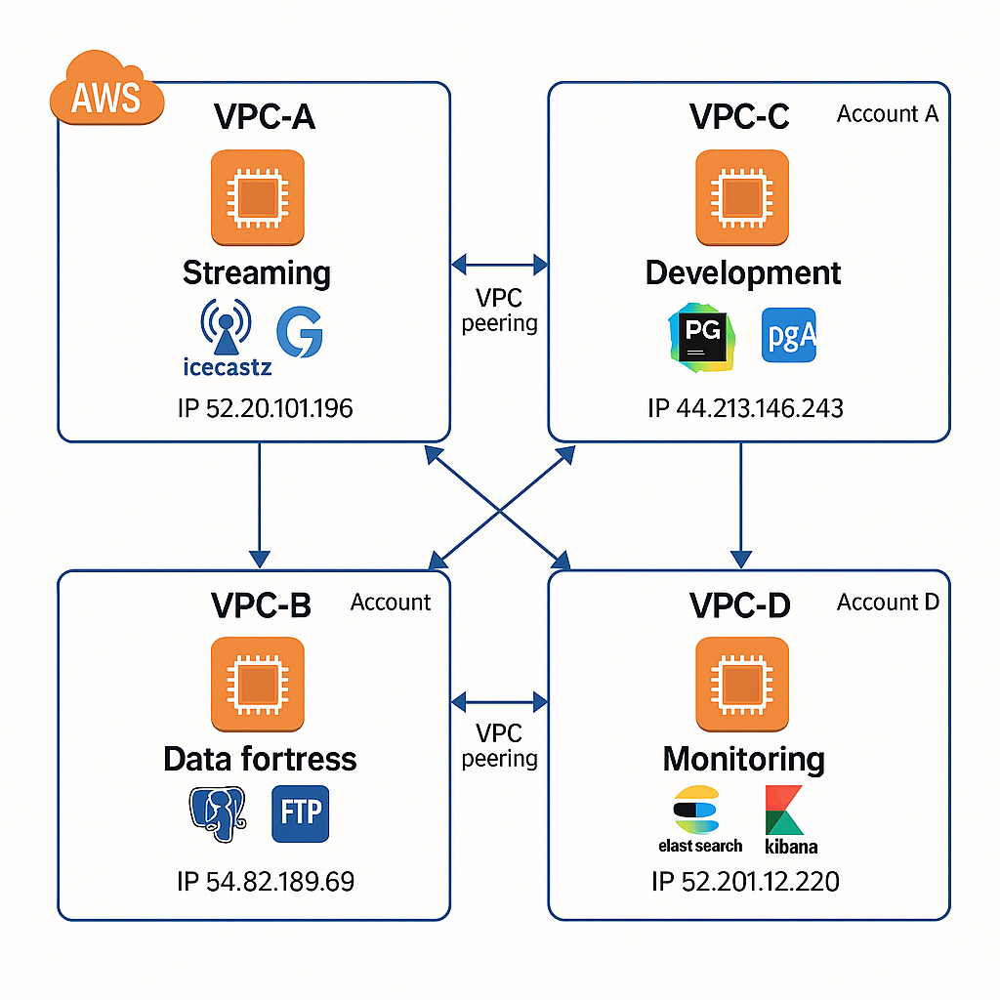

# Implementación de los servicios en AWS

Parte de este proyecto es la implementación de los servicios en AWS, usando instancias EC2. EN este documento se describe como se preparo el entorno de desarrollo y produccion, y como se implementaron los servicios.

## Diseño de la arquitectura

Antes de implementar los servicios, se analanizaron los requisitos y se definieron los servicios que se iban a implementar. Se definieron los siguientes servicios:

- *Servicio de streaming de audio y video:* Este servicio permite a los usuarios transmitir audio y video en tiempo real.
- *Base de datos:* Se utilizará una base de datos para almacenar la información de los usuarios y los contenidos.
- *Monitoring y logging:* Se implementara un servicio de monitoreo y logging para poder detectar errores y problemas en el sistema.
- *FTP y SSH:* Se implementara un servicio de FTP y SSH para poder transferir archivos y acceder a las instancias de forma segura.
- *web server:* Se implementara un servidor web para poder servir los contenidos a los usuarios.
- *Backup y recovery:* Se implementara un servicio de backup y recovery para poder recuperar los datos en caso de fallo.

## Preparación del entorno

Para que los servicios se puedan comunicar entre si de forma privada y segura, se crearon una VPC (Virtual Private Cloud) para cada instancia. Cada VPC tiene una subred privada y una subred publica, y se configuró un gateway NAT para
permitir que las instancias en la subred privada puedan acceder a Internet.

Para comunicar las instancias entre si, se configuró una tabla de rutas que permite el tráfico entre las subredes privadas y publicas. Ademas, se configuró un grupo de seguridad para cada instancia, que permite el tráfico entre las instancias y restringe el tráfico desde Internet.

## Instáncias EC2

Para poder soportar la carga de trabajo de los servicios, se crearon varias instancias EC2. Cada instancia tiene un tipo de instancia diferente, dependiendo de los requisitos de cada servicio. Se utilizaron instancias de tipo t2.micro para el entorno de desarrollo y t2.medium para el entorno de produccion.
Las instancias se configuraron con el sistema operativo Ubuntu 24.04 LTS, y se instalaron los siguientes servicios:

- *Servicio de streaming de audio y video:* Se utilizo el servidor de streaming Icecast junto con Gstreamer para transmitir audio y video en tiempo real.
- *Base de datos:* Se utilizo PostgreSQL como base de datos para almacenar la información de los usuarios y los contenidos.
  - *Monitoring y logging:* Se utilizo ElasticSearch y Kibana, junto Auditbeat para el monitoreo y logging del sistema.
  - *FTP y SSH:* Se configuro un servidor FTP (proFTP) y SSH para poder transferir archivos y acceder a las instancias de forma segura, ademas de configurar un cliente web para poder acceder a los archivos de forma sencilla.
  - *Web server:* Se utilizo Nginx como servidor web para poder servir los contenidos a los usuarios.
  - *Backup y recovery:* Se configuro un servicio de backup y recovery utilizando un script de backup con tar y gzip, que se ejecuta de forma periódica gracias a cron. Los backups son enviados a una Instancia principal del packup via SCP, y luego borrados de la instancia secundaria para liberar espacio. 

## Implementación de los servicios

- **[Implementación del servicio de audio y video](docs/02_implementacion/02.2_documentacion_tecnica/02.2.1_streaming.md)**
- **[Implementación y configuración de la BBDD](docs/02_implementacion/02.2_documentacion_tecnica/02.2.2_bbdd.md)**
- **[Desplegamiento del entorno de desarrollo](docs/02_implementacion/02.2_documentacion_tecnica/02.2.3_web.md)**
- **[Instalación y configuración del stack de Monitorización](docs/02_implementacion/02.2_documentacion_tecnica/02.2.4_elk.md)**
- **[Implementación del servicio de FTP](docs/02_implementacion/02.2_documentacion_tecnica/02.2.5_ftp.md)**
- **[Implementación del servicio de mensajeria](docs/02_implementacion/02.2_documentacion_tecnica/02.2.6_msg.md)**
- **[Implementación del servicio de backup y recovery](docs/02_implementacion/02.2_documentacion_tecnica/02.2.7_backup.md)**

