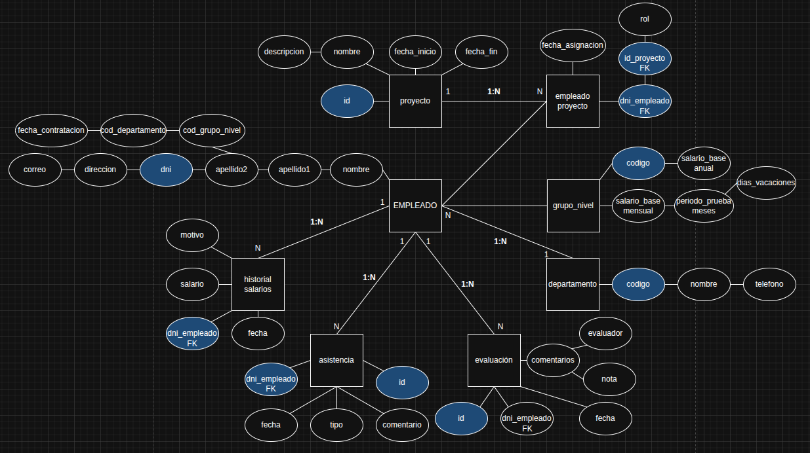

# Documentación Técnica – Base de Datos (BBDD)

## 1. Objetivo

El propósito de esta sección es definir el proceso de creación, configuración y despliegue de una base de datos para el proyecto **InnovateTech**, utilizando el sistema de gestión de bases de datos **PostgreSQL** y el entorno de nube **AWS**.

---

## 2. Herramientas y Tecnologías

- **SGBD**: PostgreSQL
- **Entorno de trabajo local**: Terminal con acceso a comandos SQL
- **Entorno remoto**: AWS (Amazon Web Services)
- **Herramienta de transferencia**: `scp` (secure copy)

---

## 3. Esquema Conceptual

Como primer paso del diseño, el equipo ha elaborado un **diagrama Entidad-Relación (E-R)** que define la estructura lógica de la base de datos. Este diagrama sirve como referencia para la posterior creación de tablas y relaciones SQL.


---

## 4. Procedimiento Técnico

### 4.1. Instalación de PostgreSQL

1. Descargar e instalar PostgreSQL desde el sitio oficial:  
    [https://www.postgresql.org](https://www.postgresql.org)
- Para instalar PostgreSQL en el sistema local, se puede utilizar el siguiente comando en distribuciones basadas en Ubuntu:

```bash
sudo apt install postgreSQL
```

2. Una vez instalado, accedemos a la consola de PostgreSQL utilizando el usuario por defecto:

```bash
psql -U postgres
```

### 4.2. Creación de la Base de Datos i Usuarios
1. Dentro de la consola SQL de PostgreSQL, creamos la base de datos principal para el proyecto y un usuario con los permisos necesarios:

```bash
CREATE DATABASE innovatetech;
CREATE USER sergio WITH PASSWORD '1234';
GRANT ALL PRIVILEGES ON DATABASE innovatech TO sergio;
```

Podemos verificar que se han creado correctamente con los siguientes comandos:

```bash
\l -- llista de BBDD
\du -- llista de usuarios
```

### 4.3. Inserción de estructura y datos
1. Redactamos un archivo .sql que contenga:
   - Creación de tablas
   - Claves primarias y foráneas
   - Índices y restricciones
   - Datos iniciales (INSERT INTO) <br>
   
Este archivo deberá guardarse localmente para su posterior transferencia. <br>
[Descargar archivo SQL completo](InnovateTechBBDD.sql)

### 4.4. Transferencia del fichero SQL a AWS
Una vez listo el archivo .sql, procedemos a subirlo al servidor remoto utilizando scp:

```bash
scp -i ./asixc1a-g5-B.pem "InnovateTech.sql" ubuntu@52.20.169.158:/home/ubuntu
```

### 4.5. Importación de los Datos a PostgreSQL
Con el archivo ya en el servidor, importamos su contenido dentro de la base de datos innovatetech:

```bash
sudo -u postgres psql -d innovatetech -f InnovateTechBBDD.sql
```

### 5. Validación
Se comprueba que:
   - La base de datos Innovatech se ha creado correctamente.
   - El usuario sergio tiene permisos adecuados.
   - Las tablas y datos se han cargado con éxito.

```bash
sudo -u postgres psql                 -- Conectarse como usuario postgres a psql
\l                                    -- Lista todas las bases de datos
\c innovatetech                       -- Conectarse a la base de datos innovatetech
\dt                                   -- Listar tablas
\SELECT * FROM empleado;              -- Mostrar todos los empleados
```

### 6. Instalación de PgAdmin4
1. PgAdmin4 es una herramienta gráfica para la gestión de bases de datos PostgreSQL. Se instala con el siguiente comando:

```bash
sudo apt install pgadmin4
```

### 6.1 Acceso a través del navegador web
1. Una vez instalado, accede a **PgAdmin4** desde un navegador introduciendo la siguiente dirección:
   - http://x.x.x.x/pgadmin4 (Cambia x.x.x.x por la IP donde tengas tu Base de Datos)

### 6.3 Conexión al servidor de base de datos
1. CAl ingresar a la interfaz de PgAdmin4, creamos una nueva conexión al servidor completando los siguientes datos:

     - **Dirección IP** del servidor con la base de datos (Campo: Host name/address)
       - Ejemplo: 10.1.1.103
       
     - **Puerto** (Campo: Port)
       - Valor por defecto en PostgreSQL: 5432
       
     - **Nombre** de la base de datos: (Campo: Database)
       - Ejemplo: innovatech

     - **Usuario** con permisos de acceso (Campo: User) 
       - Ejemplo: sergio

     - **Contraseña** asociada al usuario anterior (Campo: Password)
       - Ejemplo: @ItB2024

Una vez completados todos los campos, guardamos la configuración y accedemos a la base de datos desde PgAdmin4.

### 7. Conclusión
Gracias a este procedimiento, se ha logrado desplegar la base de datos InnovateTech de forma exitosa, cumpliendo con los requisitos funcionales del proyecto. La combinación de PostgreSQL, AWS y herramientas como PgAdmin4 proporciona una solución robusta, escalable y fácil de administrar.


