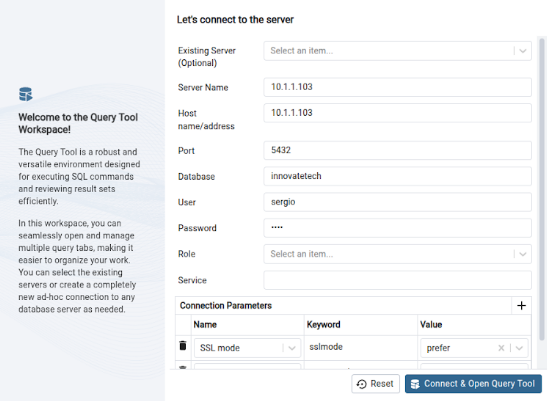

# Documentación Técnica – Base de Datos (BBDD)

## 1. Objetivo

El propósito de esta sección es definir el proceso de creación, configuración y despliegue de una base de datos para el proyecto **InnovateTech**, utilizando el sistema de gestión de bases de datos **PostgreSQL** y el entorno de nube **AWS**.

---

## 2. Herramientas y Tecnologías

- **SGBD**: PostgreSQL
- **Entorno de trabajo local**: Terminal con acceso a comandos SQL
- **Entorno remoto**: AWS (Amazon Web Services)
- **Herramienta de transferencia**: `scp` (secure copy)

---

## 3. Esquema Conceptual

El equipo ha elaborado un **diagrama Entidad-Relación (E-R)** para definir la estructura lógica de la base de datos. Este esquema sirve como base para la creación de las tablas SQL.


---

## 4. Procedimiento Técnico

### 4.1. Instalación de PostgreSQL

1. Descargar e instalar PostgreSQL desde el sitio oficial:  
    [https://www.postgresql.org](https://www.postgresql.org)
- O con el siguiente comando
```bash
sudo apt install postgreSQL
```
2. Abrir el terminal y acceder a PostgreSQL con el usuario predeterminado:

```bash
psql -U postgres
```

### 4.2. Creación de la Base de Datos i Usuarios
1. Dentro de la consola SQL, crear la base de datos i usuario:

```bash
CREATE DATABASE innovatetech;
CREATE USER sergio WITH PASSWORD '1234';
GRANT ALL PRIVILEGES ON DATABASE innovatech TO sergio;
```

2. Verificar la cración con:
```bash
\l -- llista de BBDD
\du -- llista de usuarios
```

### 4.3. Inserción de estructura y datos
1. Escribir el código SQL localmente, incluyendo:
   - Creación de tablas
   - Claves primarias y foráneas
   - Índices y restricciones
   - Datos iniciales (INSERT INTO)
  

2. SQL:
   - [Descargar archivo SQL completo](InnovateTechBBDD.sql)

### 4.4. Transferencia del fichero SQL a AWS
1. Utilizar el comando scp para subir el fichero **SQL** al servidor en **AWS**:
2. 
```bash
scp -i ./asixc1a-g5-B.pem "InnovateTech.sql" ubuntu@52.20.169.158:/home/ubuntu
```

### 4.5. Importación de los Datos a PostgreSQL 
1. Añadir el fichero **SQL** dentro de la base de datos InnovateTech
2. 
```bash
sudo -u postgres psql -d innovatetech -f InnovateTechBBDD.sql
```

### 5. Validación
1. Se comprueba que:
   - ✅ La base de datos Innovatech se ha creado correctamente.
   - ✅ El usuario innovatech_user tiene permisos adecuados.
   - ✅ Las tablas y datos se han cargado con éxito.
   - ✅ La aplicación o servicio asociado puede conectarse a la base de datos y realizar operaciones.

```bash
sudo -u postgres psql                 -- Conectarse como usuario postgres a psql
\l                                    -- Lista todas las bases de datos
\c innovatetech                       -- Conectarse a la base de datos innovatetech
\dt                                   -- Listar tablas
\SELECT * FROM empleado;              -- Mostrar todos los empleados
```

### 6. Instalación de PgAdmin4
1. Descargar e instalar **PgAdmin4**

```bash
sudo apt install pgadmin4
```

### 6.1 Acceso a través del navegador web
1. Una vez instalado, accede a **PgAdmin4** desde un navegador introduciendo la siguiente dirección:
   - http://<tu-ip>/pgadmin4

### 6.3 Conexión al servidor de base de datos
1. Cuando accedas a la interfaz de PgAdmin4:
   - Crea una nueva conexión al servidor de la base de datos.
   - Rellena los campos obligatorios:

     - **Dirección IP** privada del servidor donde está alojada la base de datos
       - Campo: Host name/address
       - Ejemplo: 10.1.1.103
       
     - **Puerto**
       - Campo: Port
       - Valor por defecto en PostgreSQL: 5432
       
     - **Nombre** de la base de datos
       - Campo: Database
       - Ejemplo: innovatech

     - **Usuario** con el que acceder a la base de datos
       - Campo: User
       - Ejemplo: sergio

     - **Contraseña** del usuario 
       - Campo: Password
       - Ejemplo: @ItB2024



Una vez completados estos datos, guarda la configuración y ya podrás gestionar tu base de datos desde la interfaz de PgAdmin4.