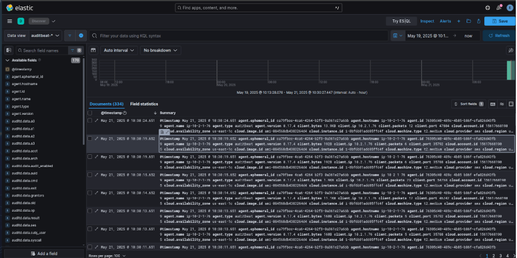

# Guía de Instalación y Configuración del ELK Stack en AWS  
Elastic y Kibana

Establecer la conexión con la máquina y crear el usuario personal, asignando como contraseña “adrian”.  


Crear el usuario llamado “elastic” y añadirlo al grupo “sudoers” para que disponga de privilegios de administrador.  


## Instalación del servicio  
Crear el directorio de elastic (/elastic)  


Instalamos elastic y kibana  
  


Descomprimimos los ficheros “tar”  


## Configuración de los servicios

Cambiamos los permisos del directorio elastic  


Ejecutamos el servicio de Elastic  
  


Configuramos Kibana  


Ejecución del kibana-setup  


Configuramos elasticsearch  


Una vez completada toda la configuración, accedemos a Elastic a través del navegador web utilizando la dirección IP pública asignada por AWS.  


## Auditbeat  
Instalación en el host  


Configuración de Auditbeat con Elastic y Kibana  
  


Cargar assets  


Iniciar Auditbeat  


Añadir Auditbeat a Elastic  


Visualización de la información  


Hacer que los servicios de Elastic, Kibana y Auditbeat se inicien con el sistema  
Creamos el servicio de Elastic  
  
  


Servicio de Kibana  
  


Servicio de Auditbeat (usuario root porque Auditbeat debe ejecutarse con sudo)  
  


## Configuración en hosts  
Configuración general en cada host:  
  


### Sergio:  


### Sharam:  


### Adrià:  


---

## Script para Auditbeat

````bash
#!/bin/bash

# Pedir datos al usuario
read -p "Introduce el nombre de usuario SSH (ej. ubuntu): " SSH_USER
read -p "Introduce la IP pública del cliente: " CLIENT_IP
read -p "Introduce la ruta a la clave .pem: " KEY_PATH

# Variables de versión
AUDITBEAT_VERSION="8.17.4"
AUDITBEAT_DIR="auditbeat-${AUDITBEAT_VERSION}-linux-x86_64"
AUDITBEAT_TAR="${AUDITBEAT_DIR}.tar.gz"

# Configuración auditbeat.yml
CONFIG_B64="..."

# Configuración del servicio systemd
SERVICE_B64="..."

# Comando remoto
ssh -i "$KEY_PATH" ${SSH_USER}@${CLIENT_IP} bash <<EOF
  set -e

  echo "[*] Creando usuario elastic..."
  sudo useradd elastic -m -s /bin/bash || true
  echo "elastic:elastic" | sudo chpasswd
  sudo usermod -aG sudo elastic

  echo "[*] Preparando directorio y descargando Auditbeat..."
  sudo mkdir -p /elastic
  cd /elastic
  sudo wget https://artifacts.elastic.co/downloads/beats/auditbeat/${AUDITBEAT_TAR}
  sudo tar -xzf ${AUDITBEAT_TAR}

  echo "[*] Aplicando configuración..."
  echo "\$(echo ${CONFIG_B64} | base64 -d)" | sudo tee /elastic/${AUDITBEAT_DIR}/auditbeat.yml > /dev/null
  sudo chown root:root /elastic/${AUDITBEAT_DIR}/auditbeat.yml

  echo "[*] Ejecutando setup de Auditbeat..."
  cd /elastic/${AUDITBEAT_DIR}
  sudo ./auditbeat setup --dashboards -e || true

  echo "[*] Creando servicio systemd..."
  echo "\$(echo ${SERVICE_B64} | base64 -d)" | sudo tee /etc/systemd/system/auditbeat.service > /dev/null

  echo "[*] Habilitando y arrancando el servicio..."
  sudo systemctl daemon-reload
  sudo systemctl enable auditbeat.service
  sudo systemctl start auditbeat.service

  echo "[✔] Auditbeat instalado y en funcionamiento."
EOF
