# Guía de Instalación y Configuración del ELK Stack en AWS  
**Elastic, Kibana y Auditbeat**

---

## 1. Conexión Inicial y Gestión de Usuarios

Establece conexión con la máquina.
Crea un usuario personal con la contraseña: adrian. 
```bash
sudo adduser "usuario"
```
```bash
sudo usermod -aG sudo "usuario"
```
  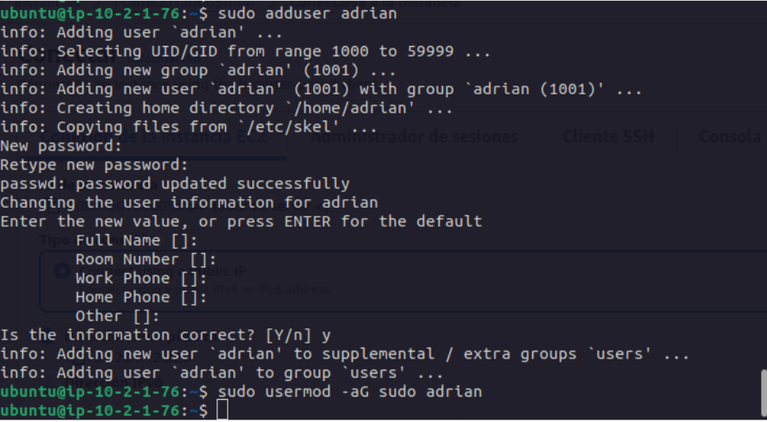

Crea el usuario elastic y añádelo al grupo sudo para otorgarle privilegios de administrador.  
```bash
sudo adduser elastic
```
```bash
sudo usermod -aG sudo elastic
```

  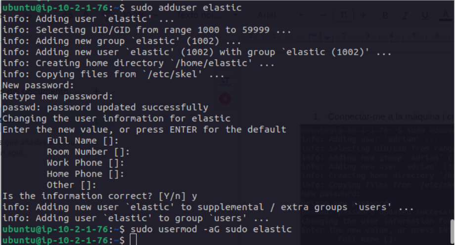

---

## 2. Instalación del ELK Stack

### 2.1 Preparación del Entorno

Crea el directorio principal de Elastic: /elastic  
```bash
sudo mkdir -p /elastic
```
  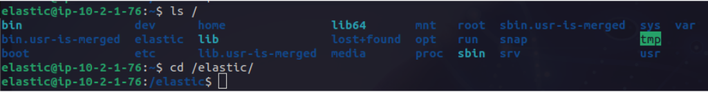

### 2.2 Descarga e Instalación

Instala Elastic y Kibana.
```bash
sudo wget hhtps://artifacts.elastic.co/downloads/elasticsearh/elasticsearch-8.17.4-linux-x86_64.tar.gz
```
  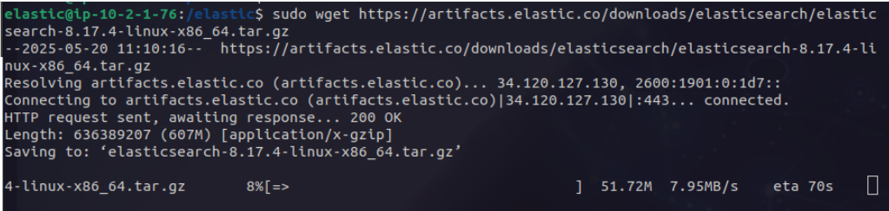  
```bash
sudo wget hhtps://artifacts.elastic.co/downloads/kibana/kibana-8.17.4-linux-x86_64.tar.gz
```
  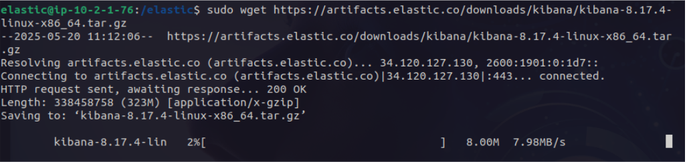

Descomprime los archivos .tar.
```bash
sudo tar -xzf elasticsearch-8.17.4-linux-x86_64.tar.gz
```
```bash
sudo tar -xzf kibana-8.17.4-linux-x86_64.tar.gz
```
  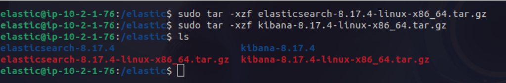

---

## 3. Configuración de Servicios

### 3.1 Elasticsearch

Cambia los permisos del directorio /elastic.
```bash
sudo chown -R elastic:elastic /elastic
```
```bash
sudo chmod -R 755 /elastic
```
  
  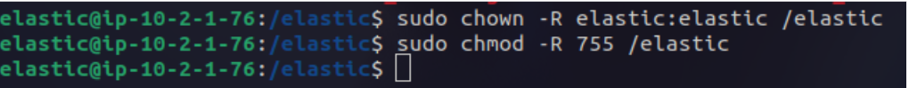

Ejecuta el servicio de Elasticsearch.
```bash
sudo ./bin/elasticsearch
```
  
  Copiar los tres tokens que se generan al ejecutarlo por primera vez.  
  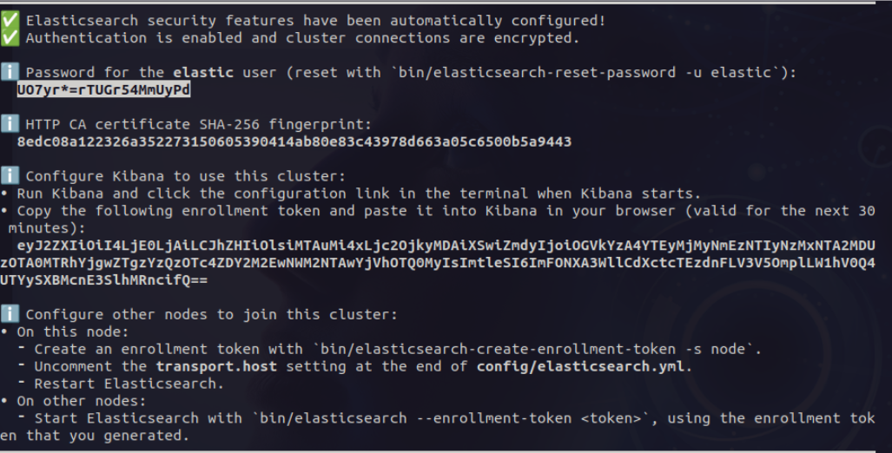

### 3.2 Kibana

Realiza la configuración inicial de Kibana.  
```bash
sudo nano /elastic/kibana-8.17.4/config/kibana.yml
```
  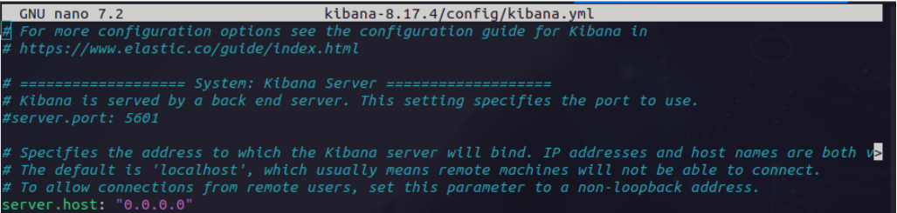

Ejecuta el kibana-setup.
```bash
sudo ./bin/kibana-setup
```
  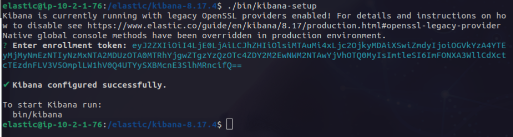

Realiza los ajustes finales en la configuración de Elasticsearch.
```bash
sudo nano /elastic/elasticsearch-8.17.4/config/elasticsearch.yml
```
  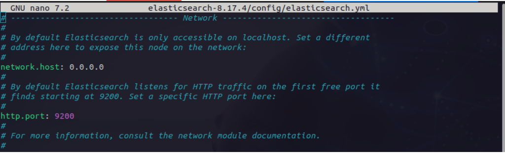

Accede a Elastic desde el navegador utilizando la IP pública de AWS.
http://IP_PUBLICA_AWS/5601
  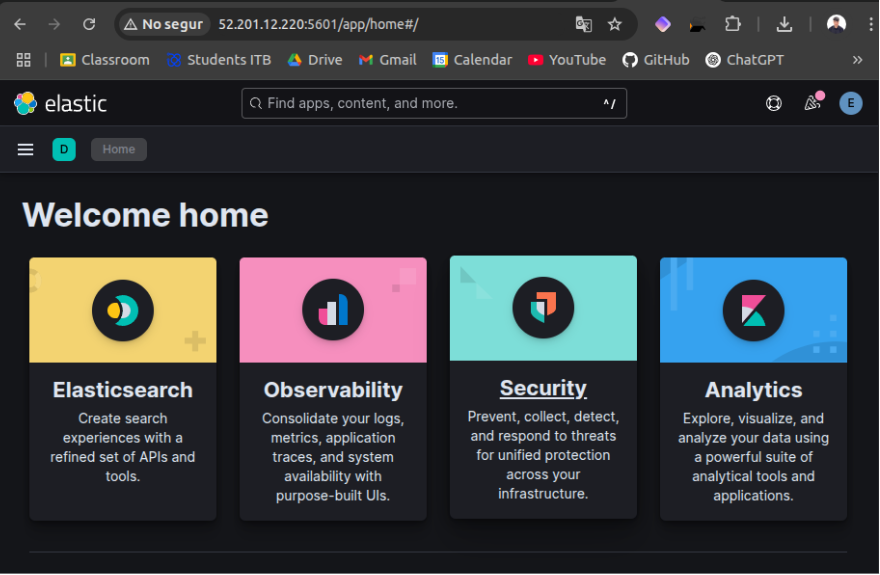

---

## 4. Integración de Auditbeat

### 4.1 Instalación

Instala Auditbeat en el host.
```bash
sudo wget hhtps://artifacts.elastic.co/downloads/beats/auditbeat/auditbeat-8.17.4-linux-x86_64.tar.gz
```
```bash
sudo tar -xzf auditbeat-8.17.4-linux-x86_64.tar.gz
```
  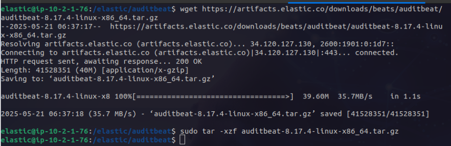

### 4.2 Configuración

Configura Auditbeat para integrarse con Elastic y Kibana.
```bash
sudo nano /elastic/auditbeat/auditbeat-8.17.4-linux-x86_64/auditbeat.yml 
```
  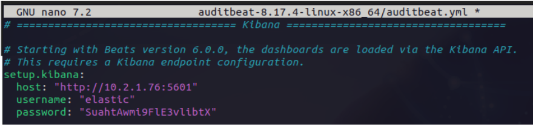  
  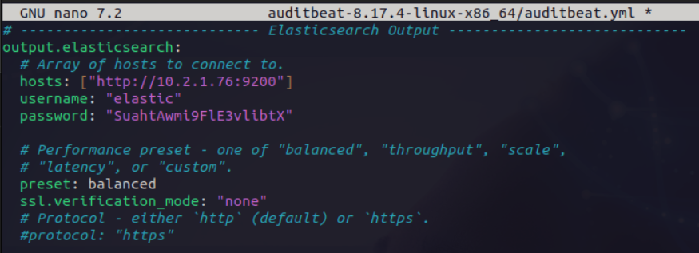

Carga los assets necesarios.

```bash
sudo chown root:root auditbeat.yml 
```
```bash
sudo ./auditbeat setup --dashboards 
```
  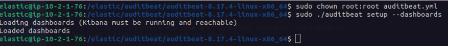

Inicia el servicio de Auditbeat.
```bash
sudo ./auditbeat setup -e 
```
  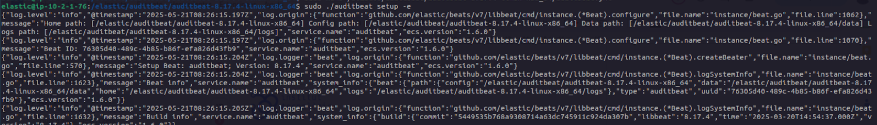

Añade Auditbeat al stack de Elastic.  
  

Verifica la visualización de los datos.  
  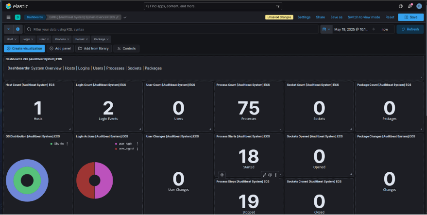

---

## 5. Configuración de Servicios al Inicio del Sistema

### 5.1 Elasticsearch

Crea el servicio de systemd para Elasticsearch.
```bash
sudo nano /etc/systemd/system/elasticsearch.service 
```
  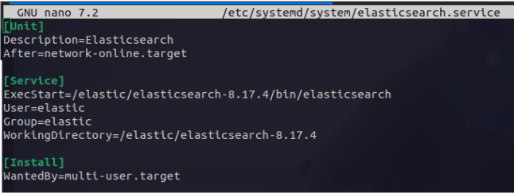  
Reiniciamos los servicios del sistema 
```bash
sudo systemctl daemon-reload 
```
    
Habilitamos y vemos el estado del servicio
``` bash
sudo systemctl enable elasticsearch
sudo systemctl start elasticsearch
sudo systemctl status elasticsearch 
```
  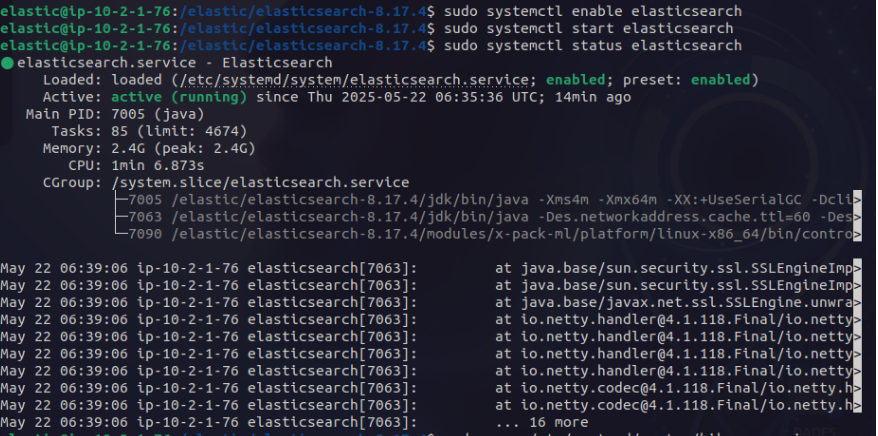

### 5.2 Kibana

Crea el servicio para Kibana.
```bash
sudo nano /etc/systemd/system/kibana.service 
```
  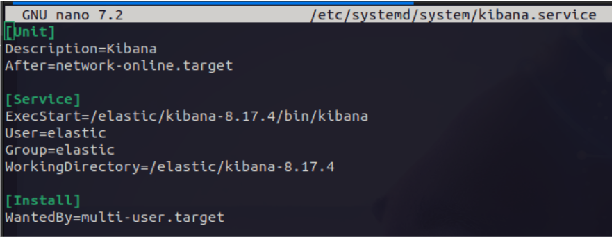  
```bash
sudo systemctl start kibana.service
sudo systemctl status kibana.service 
```
  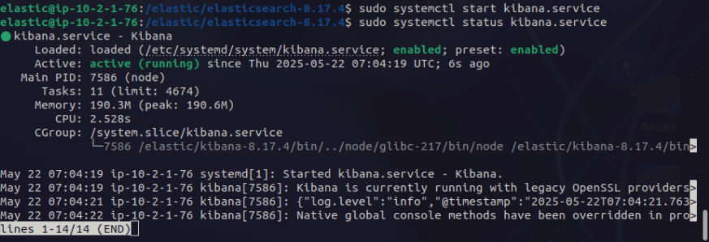

### 5.3 Auditbeat

Crea el servicio para Auditbeat (requiere privilegios de root).
```bash
sudo nano /etc/systemd/system/auditbeat.service 
```
  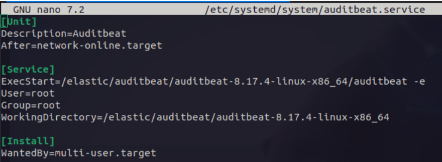
```bash
sudo systemctl enable auditbeat.service
sudo systemctl start auditbeat.service
sudo systemctl status auditbeat.service 
```
  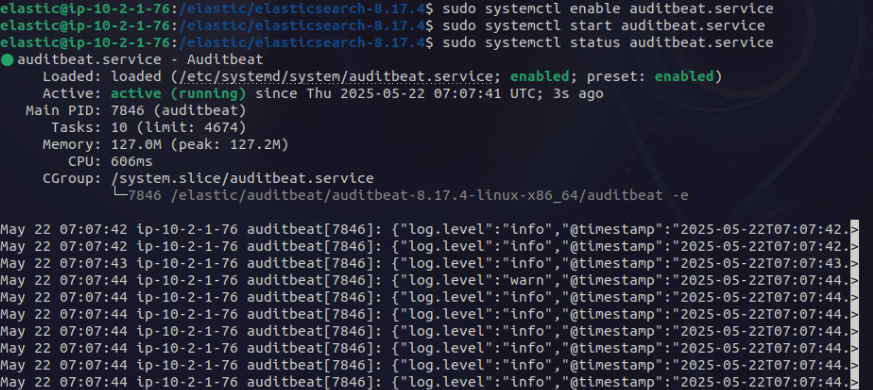

---

## 6. Configuración por Hosts

### Configuración General para Cada Host
```bash
sudo wget hhtps://artifacts.elastic.co/downloads/beats/auditbeat/auditbeat-8.17.4-linux-x86_64.tar.gz
```
Y posteriormente configurar el auditbeat.yml  
  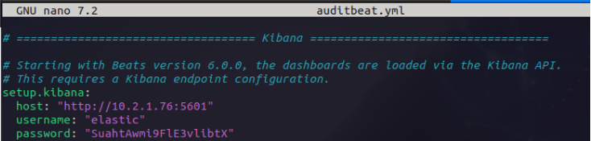  
  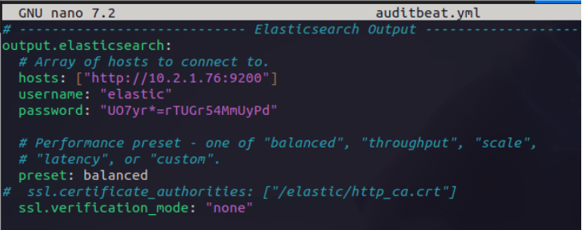

### Host: Sergio  
  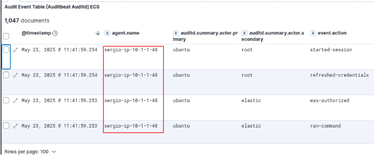

### Host: Sharam  
  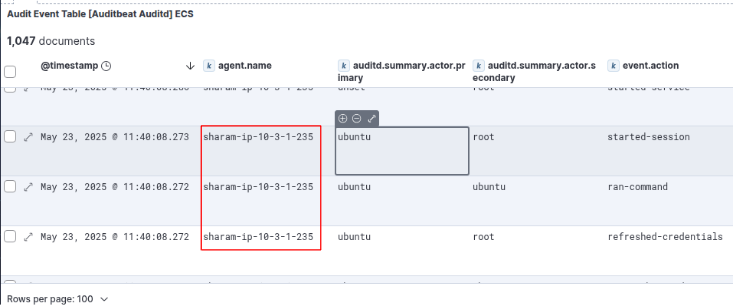

### Host: Adrià  
  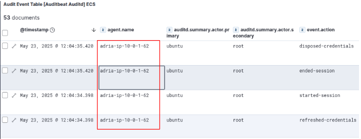

---
## Script para Auditbeat

````bash

#!/bin/bash

# Pedir datos al usuario
read -p "Introduce el nombre de usuario SSH (ej. ubuntu): " SSH_USER
read -p "Introduce la IP pública del cliente: " CLIENT_IP
read -p "Introduce la ruta a la clave .pem: " KEY_PATH

# Variables de versión
AUDITBEAT_VERSION="8.17.4"
AUDITBEAT_DIR="auditbeat-${AUDITBEAT_VERSION}-linux-x86_64"
AUDITBEAT_TAR="${AUDITBEAT_DIR}.tar.gz"

# Configuración auditbeat.yml
CONFIG_B64="..."

# Configuración del servicio systemd
SERVICE_B64="..."

# Comando remoto
ssh -i "$KEY_PATH" ${SSH_USER}@${CLIENT_IP} bash <<EOF
  set -e

  echo "[*] Creando usuario elastic..."
  sudo useradd elastic -m -s /bin/bash || true
  echo "elastic:elastic" | sudo chpasswd
  sudo usermod -aG sudo elastic

  echo "[*] Preparando directorio y descargando Auditbeat..."
  sudo mkdir -p /elastic
  cd /elastic
  sudo wget https://artifacts.elastic.co/downloads/beats/auditbeat/${AUDITBEAT_TAR}
  sudo tar -xzf ${AUDITBEAT_TAR}

  echo "[*] Aplicando configuración..."
  echo "\$(echo ${CONFIG_B64} | base64 -d)" | sudo tee /elastic/${AUDITBEAT_DIR}/auditbeat.yml > /dev/null
  sudo chown root:root /elastic/${AUDITBEAT_DIR}/auditbeat.yml

  echo "[*] Ejecutando setup de Auditbeat..."
  cd /elastic/${AUDITBEAT_DIR}
  sudo ./auditbeat setup --dashboards -e || true

  echo "[*] Creando servicio systemd..."
  echo "\$(echo ${SERVICE_B64} | base64 -d)" | sudo tee /etc/systemd/system/auditbeat.service > /dev/null

  echo "[*] Habilitando y arrancando el servicio..."
  sudo systemctl daemon-reload
  sudo systemctl enable auditbeat.service
  sudo systemctl start auditbeat.service

  echo "[✔] Auditbeat instalado y en funcionamiento."
EOF
